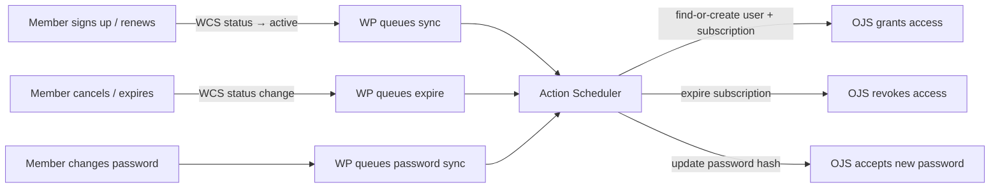

# WP OJS Sync

A pair of plugins (WordPress + OJS) that sync membership data from WordPress (via WooCommerce Subscriptions) to Open Journal Systems. Members get journal access automatically; non-members can still buy content via OJS's built-in paywall.

## Quick start

```bash
git clone https://github.com/Pharkie/wp-ojs-sync.git && cd wp-ojs-sync
cp .env.example .env                    # edit passwords before production use
docker compose up -d --build
scripts/setup.sh --env=dev --with-sample-data
npm test                                # 58 e2e tests
```

WP: http://localhost:8080 | OJS: http://localhost:8081

> **Production sync:** Always dry-run first (`wp ojs-sync sync --bulk --dry-run`), verify the output, then run the real sync with `--bulk --yes`. The `--bulk` flag is required to prevent accidental full sync. See [WP plugin reference — CLI commands](docs/wp-plugin-reference.md#wp-cli-commands) for all flags and safety options.

## How it works

WordPress is the source of truth for membership. The WP plugin hooks into WooCommerce Subscription lifecycle events and pushes changes to OJS via a custom REST API. All sync is async (Action Scheduler), with daily reconciliation to catch drift.



Bulk sync creates OJS accounts with WP password hashes — members log in to OJS with their existing WP password, no "set your password" step. Supports `--resume` for interrupted syncs.

## Documentation

**Start here:** [WP plugin reference](docs/wp-plugin-reference.md) and [OJS plugin reference](docs/ojs-plugin-reference.md) explain what each plugin does — hooks, sync actions, CLI commands, settings, auth, GDPR erasure, subscription logic.

**API** — [OJS API reference](docs/ojs-api.md) — all 13 custom endpoints with params, responses, error codes

**Deployment** — [Docker setup](docker/README.md) · [Non-Docker setup](docs/non-docker-setup.md) · [Hosting requirements](docs/private/hosting-requirements.md) · [Support runbook](docs/support-runbook.md) · [TODO / roadmap](TODO.md)

**Design** — [Implementation plan](docs/private/plan.md) · [Decision trail](docs/discovery.md) · [WP integration notes](docs/wp-integration.md) · [Plan review findings](docs/private/review-findings.md) · [Janeway backup path](docs/private/janeway-paywall-investigation.md)

## Prerequisites

- WordPress 5.6+, PHP 7.4+
- WooCommerce + WooCommerce Subscriptions
- Action Scheduler (bundled with WooCommerce)
- OJS 3.5+ (the OJS plugin requires the 3.5 plugin API)

## AI disclosure

This codebase was generated by Claude Opus 4.6 (Anthropic) and has had limited manual code review. Use at your own risk. That said, the entire development process was closely overseen by an experienced developer with particular attention to security and reliability -- every architectural decision, endpoint design, and sync behaviour was directed and verified by a human throughout.

## License

PolyForm Noncommercial 1.0.0 -- see [LICENSE.md](./LICENSE.md).
