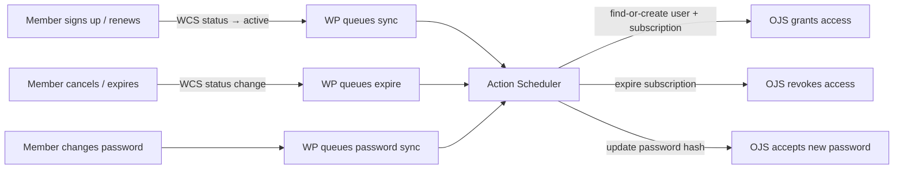

# WP OJS Sync

A pair of plugins (WordPress + OJS) that sync membership data from WordPress (via WooCommerce Subscriptions) to Open Journal Systems. Members get journal access automatically; non-members can still buy content via OJS's built-in paywall.

## How it works

WordPress is the source of truth for membership. The WP plugin hooks into WooCommerce Subscription lifecycle events and pushes changes to OJS via a custom REST API. All sync is async (Action Scheduler), with daily reconciliation to catch drift.

Bulk sync creates OJS accounts with WP password hashes — members log in to OJS with their existing WP password, no "set your password" step.

## Documentation

**Start here:** [WP plugin reference](docs/wp-plugin-reference.md) and [OJS API reference](docs/ojs-api.md) explain what each plugin does — hooks, sync actions, endpoints, auth. See also [WP-CLI reference](docs/wp-cli-reference.md) and [WP admin reference](docs/wp-admin-reference.md).

**Setup** — [Docker setup](docker/README.md) · [Non-Docker setup](docs/non-docker-setup.md) · [Hosting requirements](docs/private/hosting-requirements.md) · [Support runbook](docs/support-runbook.md) · [TODO / roadmap](TODO.md)

**Design & internals** — [Implementation plan](docs/private/plan.md) · [Decision trail](docs/discovery.md) · [OJS plugin internals](docs/ojs-plugin-internals.md) · [OJS native internals](docs/ojs-internals.md) · [WP integration notes](docs/wp-integration.md) · [Plan review findings](docs/private/review-findings.md) · [Janeway backup path](docs/private/janeway-paywall-investigation.md)

## Prerequisites

- WordPress 5.6+, PHP 7.4+
- WooCommerce + WooCommerce Subscriptions
- Action Scheduler (bundled with WooCommerce)
- OJS 3.5+ (the OJS plugin requires the 3.5 plugin API)

## LLM Generated, Human Reviewed

This code was generated with Claude Code (Anthropic, Claude Opus 4.6). Development was overseen by the human author with attention to reliability and security. Architectural decisions, configuration choices, and development sessions were closely planned, directed and verified by the human author throughout. The code and test results were reviewed and tested by the human author beyond the LLM. Still, the code has had limited manual review, I encourage you to make your own checks and use this code at your own risk.

## License

PolyForm Noncommercial 1.0.0 -- see [LICENSE.md](./LICENSE.md).
