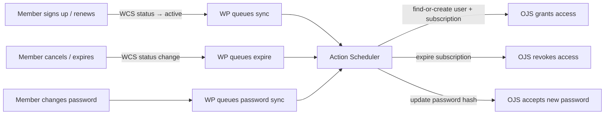

# WP OJS Sync

**The problem:** An organisation runs its membership and payments through [WordPress](https://wordpress.org/) (using WooCommerce Subscriptions), and publishes an academic journal on [OJS](https://pkp.sfu.ca/software/ojs/) (Open Journal Systems). Members should get journal access automatically when they pay, and lose it when they cancel — but these are two separate systems with no built-in connection. OJS has no subscription API, so there's no obvious way to bridge them.

**What this repo does:** A pair of plugins — the **WP plugin** and the **OJS plugin** — that keep the two systems in sync. At launch, a bulk sync creates OJS accounts for all existing members (with their WordPress password hashes, so they can log in immediately). After that, the WP plugin automatically pushes changes to OJS whenever a member signs up, renews, cancels, or expires. Non-members can still buy individual articles through OJS's built-in paywall.

## How it works

WordPress is the source of truth for membership. The WP plugin hooks into WooCommerce Subscription lifecycle events and pushes changes to OJS via a custom REST API. All sync is async (Action Scheduler), with daily reconciliation to catch drift.

Bulk sync creates OJS accounts with WP password hashes — members log in to OJS with their existing WP password, no "set your password" step.

## Documentation

**Getting started** — pick your path:
- [Run locally](docker/README.md) — Docker stack on your machine
- [Deploy to a server](docs/vps-deployment.md) — provision a VPS, deploy the Docker stack
- [Existing servers](docs/non-docker-setup.md) — install plugins without Docker

**Using the plugins** — [WP admin guide](docs/wp-admin-reference.md) · [WP-CLI commands](docs/wp-cli-reference.md) · [Support runbook](docs/support-runbook.md)

**Reference** — [WP plugin internals](docs/wp-plugin-reference.md) · [OJS plugin API](docs/ojs-sync-plugin-api.md) · [OJS plugin internals](docs/ojs-plugin-internals.md) · [Hosting requirements](docs/private/hosting-requirements.md)

**Design** — [Implementation plan](docs/private/plan.md) · [Decision trail](docs/discovery.md) · [OJS native internals](docs/ojs-internals.md) · [WP integration notes](docs/wp-integration.md) · [Plan review findings](docs/private/review-findings.md) · [Janeway backup path](docs/private/janeway-paywall-investigation.md) · [TODO / roadmap](TODO.md)

## Prerequisites

> If you're just exploring, the [Docker setup](docker/README.md) runs the full stack locally with no external dependencies.

- WordPress 5.6+, PHP 7.4+
- WooCommerce + WooCommerce Subscriptions
- Action Scheduler (bundled with WooCommerce)
- OJS 3.5+ (the OJS plugin requires the 3.5 plugin API)

## LLM Generated, Human Reviewed

This code was generated with Claude Code (Anthropic, Claude Opus 4.6). Development was overseen by the human author with attention to reliability and security. Architectural decisions, configuration choices, and development sessions were closely planned, directed and verified by the human author throughout. The code and test results were reviewed and tested by the human author beyond the LLM. Still, the code has had limited manual review, I encourage you to make your own checks and use this code at your own risk.

## License

PolyForm Noncommercial 1.0.0 -- see [LICENSE.md](./LICENSE.md).
