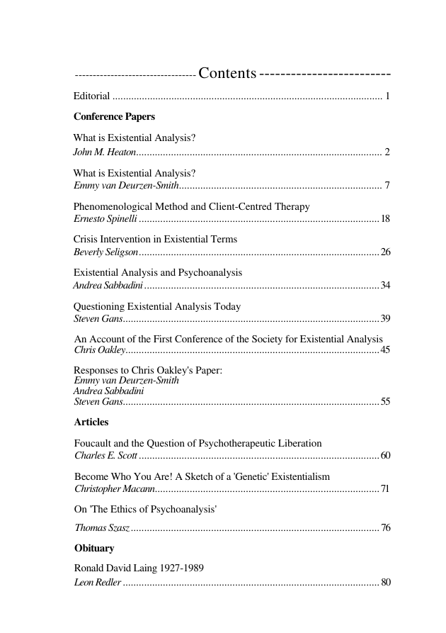
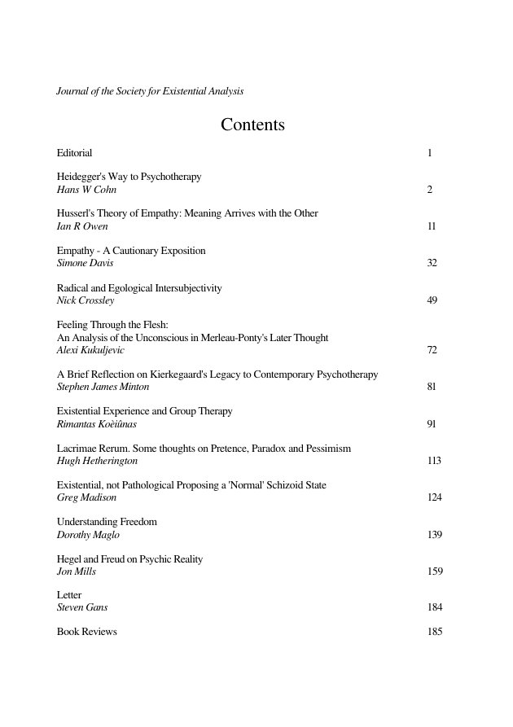

# Backfill Issue Inventory

Every issue of Existential Analysis (Vol 1–37), tracking PDF availability, TOC parsing status, and article counts for the OJS import pipeline.

## Summary

| Status | Count |
|--------|-------|
| Auto-parse OK | 64 |
| Manual TOC | 5 |
| Missing PDF | 0 |
| **Total** | **68** |

## All Issues

TOC page = PDF page number where CONTENTS heading was found. Manual TOC = sidecar `.toc.json` file in `backfill/prepared/`, auto-discovered by `split-issue.sh`.

| dot-leader | stacked | spaced | tabbed |
|:----------:|:-------:|:------:|:------:|
|  |  |  |  |
| `Title.......page` | Title, author, page on separate lines | `Title                page` | `Title\tpage` |
| 14 issues | 14 issues | 12 issues | 24 issues |

| Issue | Date | Pages | Size (MB) | TOC page | Manual TOC | TOC format | Ed | Articles | Reviews |
|-------|------|-------|-----------|----------|------------|------------|----|---------:|--------:|
| 1 | 1990 (repr. 1994) | 88 | 1 | 4 | - | dot-leader | 1 | 12 | 0 |
| 2 | 1991 | 84 | 5 | - | 2.toc.json | - | 3 | 8 | 1 |
| 3 | Jul 1992 | 146 | 1 | 4 | - | dot-leader | 0 | 12 | 1 |
| 4 | Jul 1993 | 168 | 1 | 4 | - | dot-leader | 0 | 10 | 1 |
| 5 | Jul 1994 | 187 | 1 | 2 | - | dot-leader | 1 | 13 | 1 |
| 6.1 | Jan 1995 | 202 | 11 | 4 | - | dot-leader | 0 | 12 | 0 |
| 6.2 | Jul 1995 | 204 | 11 | - | 6.2.toc.json | dot-leader | 1 | 13 | 1 |
| 7.1 | Jan 1996 | 178 | 1 | 4 | - | dot-leader | 1 | 12 | 1 |
| 7.2 | Jul 1996 | 136 | 1 | 4 | - | dot-leader | 1 | 10 | 0 |
| 8.1 | Jan 1996 | 154 | 1 | 4 | - | dot-leader | 1 | 12 | 1 |
| 8.2 | Jul 1997 | 198 | 1 | 4 | - | dot-leader | 1 | 14 | 0 |
| 9.1 | Jan 1998 | 166 | 1 | 4 | - | dot-leader | 0 | 11 | 1 |
| 9.2 | Jun 1998 | 144 | 1 | 4 | - | dot-leader | 1 | 10 | 1 |
| 10.1 | Jan 1999 | 154 | 1 | 4 | - | dot-leader | 0 | 11 | 1 |
| 10.2 | Jul 1999 | 144 | 1 | 4 | - | dot-leader | 1 | 10 | 0 |
| 11.1 | Jan 2000 | 190 | 1 | 4 | - | dot-leader | 0 | 13 | 4 |
| 11.2 | Jul 2000 | 208 | 1 | 4 | - | stacked | 1 | 12 | 1 |
| 12.1 | Jan 2001 | 186 | 1 | 4 | - | stacked | 1 | 12 | 1 |
| 12.2 | Jul 2001 | 182 | 1 | 4 | - | stacked | 0 | 12 | 0 |
| 13.1 | Jan 2002 | 182 | 11 | 4 | - | stacked | 1 | 12 | 2 |
| 13.2 | Jul 2002 | 188 | 11 | 4 | - | stacked | 1 | 11 | 0 |
| 14.1 | Jan 2003 | 190 | 12 | 4 | - | stacked | 1 | 11 | 0 |
| 14.2 | Jul 2003 | 220 | 13 | 4 | - | stacked | 1 | 14 | 0 |
| 15.1 | Jan 2004 | 185 | 1 | 2 | - | spaced | 2 | 15 | 1 |
| 15.2 | Jul 2004 | 235 | 1 | 2 | - | stacked | 2 | 15 | 1 |
| 16.1 | Jan 2005 | 200 | 1 | - | 16.1.toc.json | - | 1 | 16 | 1 |
| 16.2 | Jul 2005 | 197 | 1 | - | 16.2.toc.json | - | 1 | 14 | 1 |
| 17.1 | Jan 2006 | 215 | 1 | 2 | - | stacked | 1 | 13 | 1 |
| 17.2 | Jul 2006 | 208 | 1 | 2 | - | stacked | 1 | 14 | 0 |
| 18.1 | Jan 2007 | 206 | 1 | 3 | - | spaced | 1 | 12 | 1 |
| 18.2 | Jul 2007 | 200 | 1 | 3 | - | spaced | 1 | 12 | 1 |
| 19.1 | Jan 2008 | 201 | 1 | 3 | - | spaced | 1 | 13 | 1 |
| 19.2 | Jul 2008 | 228 | 1 | 3 | - | spaced | 1 | 12 | 0 |
| 20.1 | Jan 2009 | 185 | 1 | 3 | - | spaced | 1 | 12 | 1 |
| 20.2 | Jul 2009 | 194 | 2 | 3 | - | spaced | 1 | 14 | 0 |
| 21.1 | Jan 2010 | 177 | 1 | 3 | - | spaced | 1 | 11 | 2 |
| 21.2 | Jul 2010 | 215 | 1 | 4 | - | spaced | 1 | 14 | 0 |
| 22.1 | Jan 2011 | 194 | 1 | 3 | - | spaced | 1 | 13 | 1 |
| 22.2 | Jul 2011 | 202 | 1 | 3 | - | spaced | 1 | 13 | 0 |
| 23.1 | Jan 2012 | 193 | 1 | 4 | - | spaced | 1 | 15 | 3 |
| 23.2 | Jul 2012 | 198 | 1 | 4 | - | tabbed | 1 | 16 | 0 |
| 24.1 | Jan 2013 | 203 | 3 | 4 | - | tabbed | 1 | 13 | 3 |
| 24.2 | Jul 2013 | 201 | 3 | 4 | - | tabbed | 1 | 10 | 0 |
| 25.1 | Jan 2014 | 203 | 3 | 4 | - | tabbed | 1 | 13 | 3 |
| 25.2 | Jul 2014 | 199 | 4 | 4 | - | tabbed | 1 | 13 | 0 |
| 26.1 | Jan 2015 | 209 | 5 | 4 | - | tabbed | 1 | 14 | 2 |
| 26.2 | Jul 2015 | 202 | 3 | 4 | - | tabbed | 1 | 13 | 0 |
| 27.1 | Jan 2016 | 236 | 3 | 4 | - | tabbed | 1 | 16 | 1 |
| 27.2 | Jul 2016 | 214 | 16 | 4 | - | stacked | 1 | 14 | 0 |
| 28.1 | Jan 2017 | 246 | 18 | 4 | - | stacked | 1 | 14 | 1 |
| 28.2 | Jul 2017 | 211 | 19 | 4 | - | stacked | 1 | 14 | 0 |
| 29.1 | Jan 2018 | 174 | 4 | 4 | - | tabbed | 1 | 11 | 1 |
| 29.2 | Jul 2018 | 196 | 6 | 4 | - | tabbed | 1 | 15 | 0 |
| 30.1 | Jan 2019 | 242 | 3 | 4 | - | tabbed | 1 | 14 | 1 |
| 30.2 | Nov 2019 | 176 | 1 | 4 | - | tabbed | 1 | 11 | 0 |
| 31.1 | Jan 2020 | 224 | 2 | 4 | - | tabbed | 1 | 11 | 2 |
| 31.2 | Jul 2020 | 184 | 3 | 4 | - | tabbed | 1 | 12 | 0 |
| 32.1 | Jan 2021 | 187 | 3 | 4 | - | tabbed | 1 | 12 | 4 |
| 32.2 | Jul 2021 | 195 | 2 | 4 | - | tabbed | 1 | 12 | 0 |
| 33.1 | Jan 2022 | 212 | 2 | 4 | - | tabbed | 1 | 14 | 1 |
| 33.2 | Jul 2022 | 196 | 14 | 4 | - | tabbed | 1 | 13 | 0 |
| 34.1 | Jan 2023 | 215 | 2 | 4 | - | tabbed | 1 | 15 | 4 |
| 34.2 | Jul 2023 | 203 | 2 | 4 | - | tabbed | 1 | 12 | 0 |
| 35.1 | Jan 2024 | 215 | 2 | 4 | - | tabbed | 1 | 14 | 0 |
| 35.2 | Jul 2024 | 220 | 2 | 4 | - | tabbed | 1 | 12 | 0 |
| 36.1 | Jan 2025 | 223 | 2 | 4 | - | tabbed | 1 | 12 | 1 |
| 36.2 | Jul 2025 | 207 | 2 | 4 | - | tabbed | 1 | 15 | 0 |
| 37.1 | Jan 2026 | 233 | 8 | 4 | - | tabbed | 1 | 15 | 6 |
